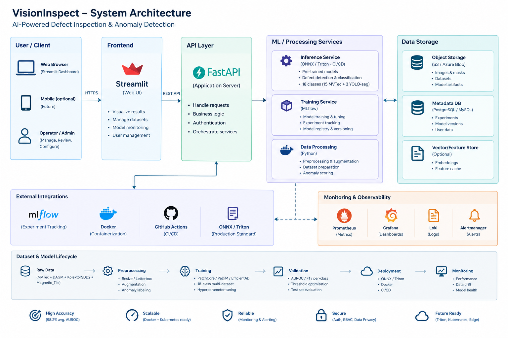

# Vision-InspectAD

**A production-shaped industrial visual inspection platform** combining unsupervised anomaly
detection and supervised defect segmentation behind a single, learned-routing inference API —
built to mirror how real manufacturing inspection systems are actually architected, not just how
a single benchmark model is trained.

[](.github/workflows/ci.yml)
[](pyproject.toml)
[](#license)

<!-- insert Video clip here from assets directory-->


Full setup/operational commands for every phase see **[docs/OPERATIONS.md](docs/OPERATIONS.md)** or complete **[Documentation](docs/Documentation.md)**.
This README covers what the project does, why it's built the way it is, and how the pieces fit
together.

---

## The problem this project is actually solving

Most portfolio computer-vision projects pick one dataset, one model, and call it done. Real
industrial inspection lines don't get that luxury: some product lines have thousands of labeled
defect images, others have almost none — just a pile of known-good parts. Forcing every product
through the same model family produces either a supervised detector with no data to train on, or
an anomaly detector thrown at a problem that already has perfectly good labels sitting unused.

VisionInspect handles both regimes side by side and — the actually hard part — **automatically
figures out which one applies to a given image before running inference**, since none of the
underlying models can tell you "this input isn't for me."

## Architecture


**The one decision that shapes everything else:** Anomalib's models are one-class — a `bottle`
checkpoint has no concept that `cable` images exist, so no downstream model can ever recognize
"this input isn't for me." A lightweight classifier (the router) has to make that call *before*
inference runs, not inside any one model. Every other architectural choice here — the shared
prediction schema, the central dispatch registry, the confidence-gated fallback — exists to
support that one fact cleanly.

---

## Why each tool, beyond "it's popular"

The point of this section: every tool below was picked for a specific engineering reason that
generalizes past this one project. This is the kind of reasoning an ML engineering interview
actually probes for.

| Tool / Technique | Why it's here | Where this matters beyond this project |
|---|---|---|
| **Anomalib / PatchCore** | Unsupervised anomaly detection — trains only on "normal" examples, no labeled defects needed. | The realistic industrial case: most production lines have abundant good-part images and very few labeled defect examples (defects are rare *by design*). Any real inspection system needs a path that doesn't depend on having thousands of labeled failures. |
| **One model per MVTec category, not one shared model** | PatchCore is one-class by construction — a shared model can't represent "normal" for 15 visually distinct products at once. | Mirrors how real inspection stations work: one camera on one line sees one product. Model-per-SKU is standard in manufacturing CV, not a limitation to work around. |
| **YOLO26-seg, 3 separate specialists** | Supervised instance segmentation where labeled defects genuinely exist (DAGM, Kolektor SDD2, Magnetic Tiles) — trained per-dataset rather than merged, since the domains (fabric texture, PCB commutators, cast metal) don't share meaningful visual structure. | Choosing supervised vs. unsupervised per data reality — not per personal preference — is the actual skill; defaulting to "the fancier method" regardless of what data exists is a common junior mistake. |
| **YOLO26n-cls router** | A cheap, fast classifier deciding *which* specialist model should even run, before the expensive inference happens. | This is the general "model routing / gating" pattern used throughout production ML systems (e.g. mixture-of-experts, cascade classifiers, LLM routing to a cheap vs. expensive model). Nano-sized deliberately — it runs in front of every single request. |
| **Confidence-gated dispatch (returns "unrecognized," not a guess)** | Below a trust threshold, the router refuses to route rather than picking its best guess. | A silent misroute (sending a part to the wrong model) produces a confident-looking, completely wrong result — worse than an honest failure. This "reject option" pattern matters anywhere a wrong automated decision is costlier than a flagged one (medical imaging, fraud detection, autonomous systems). |
| **MLflow (SQLite-backed)** | Every training run's params, metrics, and artifact are logged and traceable back by run ID. | Reproducibility isn't optional in regulated or safety-adjacent industries — "which exact run produced this deployed checkpoint" needs to be answerable, not reconstructed from memory. |
| **ONNX** | A framework-neutral export format — Anomalib (PyTorch) and Ultralytics (also PyTorch, different internals) both compile down to the same interchange format. | Decouples *how* a model was trained from *how* it's served. Training-time framework choices shouldn't dictate production runtime — this is exactly why ONNX exists as an industry standard. |
| **FastAPI** | Async-native REST API with automatic OpenAPI docs and pydantic-based request/response validation. | Standard for production Python inference services — type-checked contracts catch integration bugs at the boundary instead of downstream. |
| **Shared pydantic schema across backends** | Anomalib (heatmaps, no class label) and YOLO (boxes, masks, class labels) outputs get normalized into one `PredictionResult` shape. | Consumers (UI, downstream systems, other services) shouldn't need to know which model answered. This is the same principle behind API versioning and service contracts in larger systems. |
| **NVIDIA Triton Inference Server** | Multi-model, GPU-optimized serving with dynamic batching, opt-in via `VI_USE_TRITON=true`. | The step from "a model that works" to "a serving layer that scales" — Triton is what real MLOps teams reach for when serving more than one model efficiently, rather than each team hand-rolling their own inference server. |
| **Scoped Triton migration (YOLO only, not Anomalib)** | Ultralytics has native, verified Triton support that preserves its own pre/post-processing exactly; Anomalib has no equivalent, and hand-replicating its normalization against raw tensors is a correctness risk, not just extra work. | Knowing *not* to migrate something — because the risk of a silent wrong-result bug outweighs the benefit — is a real production engineering judgment call, not a shortcut. |
| **Docker + Docker Compose** | Reproducible environments; API and Streamlit UI as separate, independently scalable services. | Environment parity between a laptop and a production host is the difference between "works on my machine" and an actual deployable system. |
| **Model weights on Hugging Face Hub, not Git** | Git (and Git LFS's free tier) isn't built for multi-GB binary artifacts; HF Hub is. | This is the same problem solved by DVC, cloud object storage, or a proper model registry in industry — code and large binary artifacts have fundamentally different versioning needs. |
| **GitHub Actions CI (test / lint / docker-build), runnable locally via `act`** | Every push runs unit tests, linting, and a Docker build — catchable *before* a real deploy, and debuggable locally without waiting on a remote runner. | Automated quality gates are table stakes in any team environment; being able to reproduce CI failures locally (rather than push-and-pray) is what separates a workable CI setup from a frustrating one. |
| **pytest with stubbed heavy dependencies** | The full ML stack (torch, anomalib, ultralytics) isn't installed for the fast CI test job — `conftest.py` stubs those modules, since tests mock their public interfaces directly anyway. | Fast, cheap CI encourages people to actually run it; a slow test suite gets skipped. Separating "does the logic work" (fast, mocked) from "does the real stack build" (slower, the Docker job) is a standard test-pyramid tradeoff. |
| **Central path/registry configuration (`src/common/paths.py`, `model_registry.py`)** | One file is the single source of truth for every path and every router-class-to-model mapping; every training script, the API, and Triton's model repository generator all read from it. | Configuration drift across scripts (one script's default path silently disagreeing with another's) was a real, repeated bug class earlier in this project's history — centralizing it is the fix, not a stylistic preference. |

---

## Results — Phase 1 baseline (PatchCore, all 15 MVTec AD categories)

Trained sequentially on a single RTX 5070 (8GB VRAM) in **19 minutes total** — PatchCore's
"training" is largely feature extraction plus coreset subsampling, not backpropagation, so this is
cheap even on modest hardware.

| Category | Image-AUROC | Category | Image-AUROC | Category | Image-AUROC |
|---|---|---|---|---|---|
| bottle | 1.000 | hazelnut | 1.000 | screw | 0.946 |
| cable | 0.985 | leather | 1.000 | tile | 1.000 |
| capsule | 0.989 | metal_nut | 0.996 | toothbrush | 0.919 |
| carpet | 0.993 | pill | 0.953 | transistor | 0.999 |
| grid | 0.985 | | | wood | 0.987 |
| | | | | zipper | 0.979 |

**Mean image-AUROC: 98.2%** · **Mean pixel-AUROC: 97.9%** across all 15 categories — in line with
PatchCore's published benchmark numbers. `screw` and `toothbrush` are the hardest categories here,
matching known weak spots for this method in the literature (not a training bug — verified against
published results before trusting it).

---

## Project Structure

```text
visioninspect/
├── src/
│   ├── anomalib_pipeline/    # PatchCore training, evaluation, dataset verification
│   ├── yolo_pipeline/        # YOLO26-seg specialist training (3x, one per dataset)
│   ├── router_pipeline/      # Router dataset prep + training (18-class classifier)
│   └── common/
│       ├── paths.py          # single source of truth for every path in the project
│       ├── model_registry.py # router class to {backend, checkpoint} dispatch table
│       └── schemas.py        # shared PredictionResult schema across backends
├── api/
│   ├── main.py                # FastAPI app, loads everything once at startup
│   ├── routes.py               # /predict: route, resolve, infer, normalize
│   ├── config.py               # runtime settings, env-var overridable
│   └── backends/                # Anomalib (OpenVINO) / YOLO (Ultralytics, local or Triton)
├── serving/
│   ├── triton/generate_model_repository.py  # builds Triton's model repo from real exports
│   └── benchmark.py            # p50/p95/p99 latency + throughput against /predict
├── scripts/
│   └── download_models.py      # HF Hub model download, version-checked, interactive/CI-aware
├── app/streamlit_app.py        # demo UI
├── tests/                       # pytest suite, heavy ML deps stubbed for fast CI
├── .github/workflows/ci.yml    # test / lint / docker-build on every push
└── docker-compose.yml           # api + streamlit (+ triton, opt-in via --profile triton)
```

## Quickstart

```bash
git clone https://github.com/zubi9/Vision-InspectAD.git && cd Vision-InspectAD
pip install -r requirements.txt

# Download pretrained weights (see docs/OPERATIONS.md for the full HF Hub workflow)
python scripts/download_models.py --repo-id zubai4/Vision-InstpectAD

# Run everything locally
docker compose up --build

# Run With Triton Inference Server
docker compose --profile triton up --build

# API: http://localhost:8000/docs · Streamlit: http://localhost:8501
```

Training from scratch, exporting to ONNX, Triton deployment, and the full test/CI workflow are all
documented in **[docs/OPERATIONS.md](docs/OPERATIONS.md)**.

## Roadmap

| Phase | Status | Deliverable |
|---|---|---|
| 1 — Data & Anomalib baseline | Done | PatchCore trained on all 15 MVTec categories |
| 2 — Model comparison | Optional | PaDiM / EfficientAD vs. PatchCore |
| 3 — Inference API | Done | FastAPI, router-dispatched, ONNX Runtime / OpenVINO |
| 4 — Demo & Docker | Done | Streamlit UI, Docker Compose |
| 5 — Testing & CI | Done | pytest suite, GitHub Actions (test/lint/docker-build) |
| 6 — Triton & deployment | Done | Triton (YOLO models), HF Hub model distribution, benchmarking |

## License

MIT — see [LICENSE](LICENSE).
